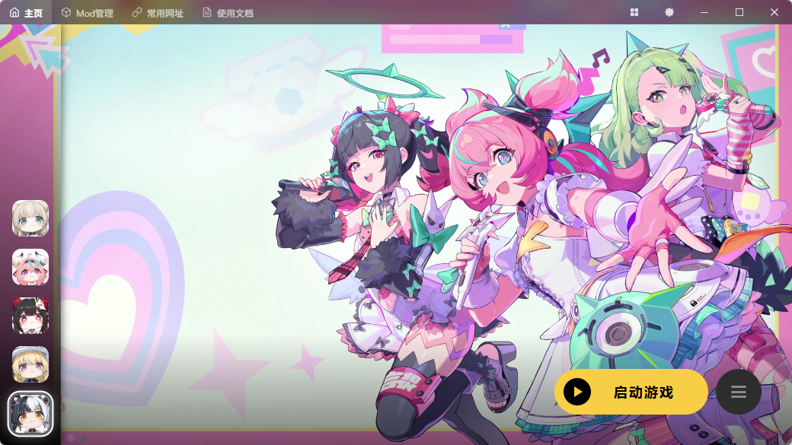

<div align="center">

# SSMT4 Linux

第四代超简单 Linux 游戏工具箱  
Super Simple Linux Game Tools 4th

[](https://github.com/peachycommit/ssmt4-linux/stargazers)
[](https://github.com/peachycommit/ssmt4-linux/network)
[](https://github.com/peachycommit/ssmt4-linux/issues)
[](./LICENSE)
[](https://github.com/peachycommit/ssmt4-linux/releases)

</div>



## 项目信息

SSMT4 Linux 是一个基于 `Tauri + Vue 3 + Rust` 的 Linux 游戏工具箱，目标是统一管理游戏下载、启动、Wine/Proton、DXVK 与游戏配置。

当前支持游戏（6 个）：

- `Arknights`：明日方舟（已测试）
- `ArknightsEndfield`：明日方舟：终末地（已测试）
- `HonkaiStarRail`：崩坏：星穹铁道（已测试）
- `ZenlessZoneZero`：绝区零（已测试）
- `WutheringWaves`：鸣潮（已测试）
- `SnowbreakContainmentZone`：尘白禁区（未测试）

## 直接引用与上游来源

说明：

- 本节只列出项目中明确直接使用、直接同步、直接下载或直接依赖的上游仓库 / 作者。
- 仅作参考后已重构实现的仓库不在此列。
- 常规 npm / Cargo 第三方依赖的完整清单，以 `package.json`、`src-tauri/Cargo.toml` 为准。

<details>
<summary>运行时直接使用的数据与包源</summary>

- `peachycommit/data-linux`
  作者 / 维护者：`peachycommit`
  用途：作为游戏目录模板、catalog、Proton / DXVK / VKD3D 等运行时数据源。
- `xiaobai01111/data-parameters`
  作者 / 维护者：`xiaobai01111`
  用途：作为 `data-linux` 的镜像仓库。
- `SpectrumQT/XXMI-Libs-Package`
  作者 / 维护者：`SpectrumQT`
  用途：项目会直接下载并使用 XXMI / 3DMigoto 核心库包。
- `SpectrumQT/WWMI-Package`
  作者 / 维护者：`SpectrumQT`
  用途：项目会直接下载并使用 WWMI 包。
- `SpectrumQT/SRMI-Package`
  作者 / 维护者：`SpectrumQT`
  用途：项目会直接下载并使用 SRMI 包。
- `SpectrumQT/EFMI-Package`
  作者 / 维护者：`SpectrumQT`
  用途：项目会直接下载并使用 EFMI 包。
- `SilentNightSound/GIMI-Package`
  作者 / 维护者：`SilentNightSound`
  用途：项目会直接下载并使用 GIMI 包。
- `leotorrez/ZZMI-Package`
  作者 / 维护者：`leotorrez`
  用途：项目会直接下载并使用 ZZMI 包。
- `leotorrez/HIMI-Package`
  作者 / 维护者：`leotorrez`
  用途：项目会直接下载并使用 HIMI 包。

</details>

<details>
<summary>主要直接依赖的框架仓库</summary>

- `tauri-apps/tauri`
  用途：桌面应用壳、命令桥接与打包。
- `vuejs/core`
  用途：前端界面框架。
- `vuejs/router`
  用途：前端路由。
- `intlify/vue-i18n`
  用途：国际化。
- `element-plus/element-plus`
  用途：前端组件库。

</details>

## 架构说明

整体架构分为三层：

1. 前端层（Vue）
- 页面与组件位于 `src/`
- 通过 `src/api.ts` 调用 Tauri 命令

2. 桌面桥接层（Tauri）
- 命令注册位于 `src-tauri/src/commands_registry.rs`
- 启动初始化位于 `src-tauri/src/bootstrap.rs`

3. 核心能力层（Rust）
- 游戏扫描与配置：`src-tauri/src/commands/game_scanner.rs`、`src-tauri/src/commands/game_config.rs`
- 启动与兼容层：`src-tauri/src/commands/game_launcher.rs`、`src-tauri/src/wine/`
- 设置与数据库：`src-tauri/src/commands/settings.rs`、`src-tauri/src/configs/database.rs`

关键数据来源：

- 数据参数独立仓库（GitHub）：<https://github.com/peachycommit/data-linux>
- 数据参数镜像仓库（Gitee）：<https://gitee.com/xiaobai01111/data-parameters>
- 运行时本地目录：`<dataDir>/data-linux`（旧版 `Data-parameters` 会自动兼容/迁移，启动时自动 `git clone/pull`）
- 数据结构：
  - `catalogs/`：游戏/API/Proton/DXVK 的 JSON 种子
  - `games/`：游戏模板 `Config.json` 与图标
  - `proton/`：GE、DW 等分组配置
- 版本信息：根目录 `version`、`version-log`

说明：主项目运行时优先读取外部 `data-linux` 仓库（旧名 `Data-parameters`），不再依赖内置 `resources/bootstrap` 与 `resources/Games` 作为主数据源；资源同步、资源版本检查和主程序版本检查都会优先尝试 GitHub，失败后自动回退到 Gitee 镜像。

## 安装方式

### 方式 1：使用打包产物安装（推荐）

执行：

```bash
pnpm run package:linux
```

产物输出目录：

- `Installation package/`

包含：

- `.deb`
- `.rpm`
- `.pkg.tar.zst`（pacman）

安装示例：

```bash
# Debian / Ubuntu
sudo dpkg -i "Installation package/SSMT4-Linux_*.deb"

# Fedora / RHEL
sudo rpm -ivh "Installation package/SSMT4-Linux-*.rpm"

# Arch / Manjaro
sudo pacman -U "Installation package/ssmt4-linux-*.pkg.tar.zst"
```

如果通过 AUR 构建，PKGBUILD 会默认先探测 GitHub，可用时继续使用 GitHub；GitHub 不可用时会自动切换到 Gitee 镜像。

如果你需要强制指定镜像，也可以手动切到 Gitee：

```bash
SSMT4_AUR_SOURCE_MIRROR=gitee yay -S ssmt4-linux
```

### 方式 2：开发环境运行

环境要求：

- Node.js
- pnpm（建议通过 `corepack enable` 启用）
- Rust（stable）
- Tauri v2 依赖（`webkit2gtk`、`gtk3`、`libsoup3` 等）

执行：

```bash
corepack enable
pnpm install
pnpm run tauri dev
```

### Arch 依赖分层安装（含 `umu-run`）

分层定义：

核心（`core`，必需）

- `gtk3`
- `webkit2gtk-4.1`
- `libsoup3`
- `xdg-utils`

X（游戏基础运行）

- `xorg-xwayland`
- `wine`
- `winetricks`
- `libayatana-appindicator`
- `wayland`

XX（推荐，运行增强）

- `umu-launcher`（`umu-run`）
- `bubblewrap`（`bwrap` 沙盒）
- `vulkan-tools`（`vulkaninfo`）
- `pciutils`（`lspci`）
- `7zip`
- `unzip`
- `git`
- `polkit`（`pkexec`）
- `procps-ng`（`ps/pgrep`）

XXL（扩展游戏栈）

- `steam`
- `steam-devices`
- `mangohud`
- `lib32-mangohud`
- `gamescope`
- `gamemode`
- `lib32-vulkan-icd-loader`

## 配置与数据目录

默认目录（Linux）：

- 配置目录：`~/.config/ssmt4`
- 数据目录：`~/.local/share/ssmt4`
- 缓存目录：`~/.cache/ssmt4`

如果你在设置中配置了自定义数据目录，游戏配置、下载内容等会使用自定义路径。

## 反馈与支持

- Gitee 镜像仓库：<https://gitee.com/xiaobai01111/ssmt4-linux>
- 使用文档（Wiki）：<https://github.com/peachycommit/ssmt4-linux/wiki>
- Issues：<https://github.com/peachycommit/ssmt4-linux/issues>
- 讨论/建议：<https://github.com/peachycommit/ssmt4-linux/discussions>
- 反馈 QQ 群：`836016004`

## 仓库 Star

如果这个项目对你有帮助，欢迎点一个 Star：

- <https://github.com/peachycommit/ssmt4-linux>

## Star History

[](https://www.star-history.com/#peachycommit/ssmt4-linux&type=date&legend=top-left)

## License

本项目采用 `GPL-3.0` 许可证（以仓库实际 License 文件为准）。
